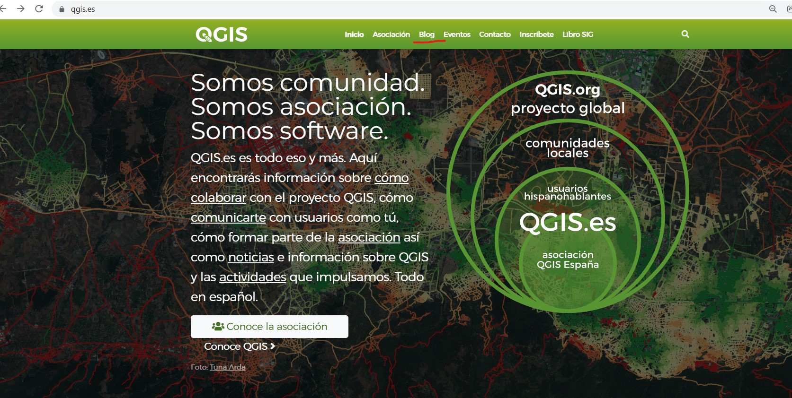
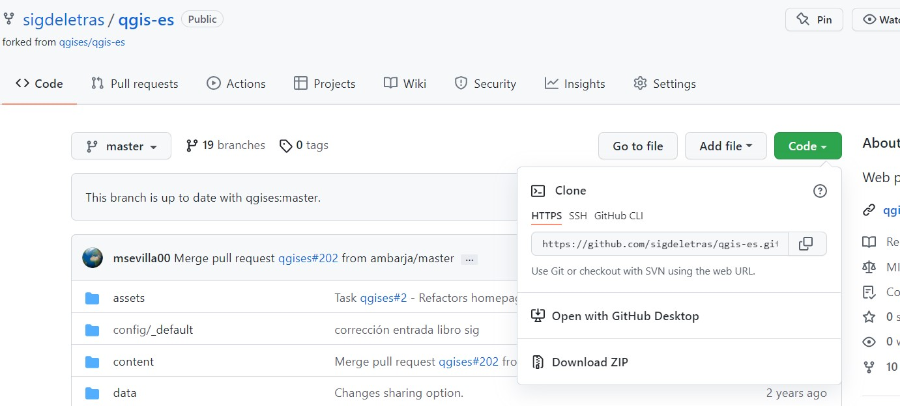

## Página web de la Asociación

[https://www.qgis.es/](https://www.qgis.es/)



Tenemos un apartado de blog, por ejemplo [https://www.qgis.es/post/2021-12-15-qgis-no-esta-afectado-por-log4j/](https://www.qgis.es/post/2021-12-15-qgis-no-esta-afectado-por-log4j/)


El código de la página web está se encuentra en GitHub, que de forma sencilla es una página que aloja proyectos de código principalmente y que usa control de versiones.

[https://github.com/qgises/qgis-es](https://github.com/qgises/qgis-es)

El mismo proyecto QGIS también se encuentra GitHub.

GitHub no es la única opción. La Asociación también cuenta con cuenta en GitLab [https://gitlab.com/qgis_es]

## ¿Cuáles son los archivos que necesitamos editar para añadir una entrada en el blog?

- Autores Carpeta [/content/authors](https://github.com/qgises/qgis-es/tree/master/content/authors)
- Entradas. Carpeta [/content/post](https://github.com/qgises/qgis-es/tree/master/content/post)

Tanto para autores como para los post debemos crear una carpeta que debe contener un archivo *index.md*
y todas las imágenes que queramos añadir.

La carpeta de los post debe tener como prefijo la fecha en formato (2022-01-21) más el nombre que queremos que aparezca en la URL


En la carpeta del autor basta con nuestro nombre.


**No debemos usar espacios para separa palabras. Usamos guiones**

## Markdown

Markdown es un lenguaje de marcado que facilita la aplicación de formato (negrita, enlaces, encabezados,listas...) a un texto empleando una serie de caracteres de una forma especial. 

Como explica "John Gruber":http://daringfireball.net/projects/markdown/, uno de sus creadores, Markdown es realmente dos cosas: por un lado, el lenguaje; por otro, una herramienta de software que convierte el lenguaje en HTML válido.

[Qué es Markdown, para qué sirve y cómo usarlo](https://www.genbeta.com/guia-de-inicio/que-es-markdown-para-que-sirve-y-como-usarlo)

En el siguiente enlace tenemos una guía de las marcas que se usan en Markdown

[Markdown Cheat Sheet](https://www.markdownguide.org/cheat-sheet/)

Vemos un ejemplo en el blog:
- [Entrada en la web](https://www.qgis.es/post/2021-03-29-qgis-docker/)
- [Post en MarkDown](https://github.com/qgises/qgis-es/tree/master/content/post/2021-03-29-qgis-docker)


## Creando nuestra propia entrada mediante Pull Request

Artículo recomendado [Cómo hacer tu primer pull request en GitHub](https://www.freecodecamp.org/espanol/news/como-hacer-tu-primer-pull-request-en-github/)
Vamos a usar el este repositorio para reproducir el flujo que debemos hacer

1. Crear una copia (bifurcación/fork)

Creamos una copia del proyecto general en nuestra cuenta de Github. A partir de ese momento podemos trabajar con el código sin que el proyecto original se vea afectado


2. Clonar el repositorio en nuestro equipo local. Hay varias opciones
  - Descarga el zip
  - Hacer un git clone

```
git clone https://github.com/sigdeletras/taller-blog-qgises.git
```




3. Crear una rama (branch)

Abrimos la carpeta en VSCode. Recordad que antes de usar Git por primera vez hay que configurarlo con nuestros datos

```
$ git config --global user.name "John Doe"
$ git config --global user.email johndoe@example.com
```

Es una buena práctica crear una rama (branch) nueva cuando trabajas con repositorios. El nombre de la rama debe ser breve y debe reflejar el trabajo que estamos haciendo.

Usamos git checkout o lo hacemos desde VSCode

```
git checkout -b articulo_tunombre
```


- Añadir nuestro archivos e ir registrando los cambios (commit)

Para añadir el artículo en e blog lo mejor es la carpeta existente, añadir el texto del blog con Markdown y modificar los parámetros.

Si no tenemos 'ficha' de autor en el blog debemos seguir los mismos pasos

Cuando queramos hacer un registro de nuestros cambios haremos un *commit* donde comentaremos brevemente los trabajos y cambios realizados. Esto es la clave de los sistemas de control de versiones.

```
git status
git add
git commit -m 'Añadida ficha de autor'
```


5. Envía los cambios a GitHub

- Pedir que los cambios sean añadidos al repositorio de QGIS ES (Pull Request)

```
git push origin [Nombre de la Rama]

```

6. Crea un pull request

Ve a tu repositorio en GitHub y verás un botón llamado "Pull request", has clic en él.

Es interesante hacer un resumen de los trabajos que tiene el PR para que el 'dueño' del repositorio original sepa que trabajos se a realizado, pueda valorarlos y si lo cree oportuno añadirlos, aceptado el PR.


7. Sincroniza tu rama maestra con la del repositorio original
   
Antes de enviar cualquier pull request al repositorio original debes sincronizar tu repositorio con aquel.

Incluso si no vas a enviar un pull request al repositorio original, es mejor efectuar la sincronización, ya que pueden haberse agregado algunas prestaciones o funciones adicionales y haberse corregido algunos errores desde la vez que realizaste un fork de aquel repositorio.

https://docs.github.com/es/pull-requests/collaborating-with-pull-requests/working-with-forks/syncing-a-fork